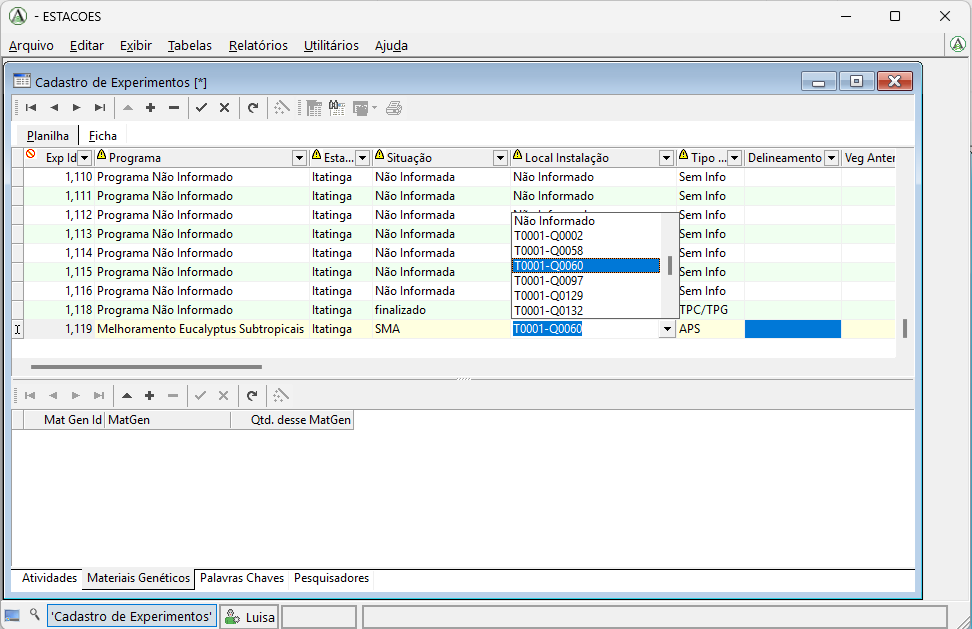
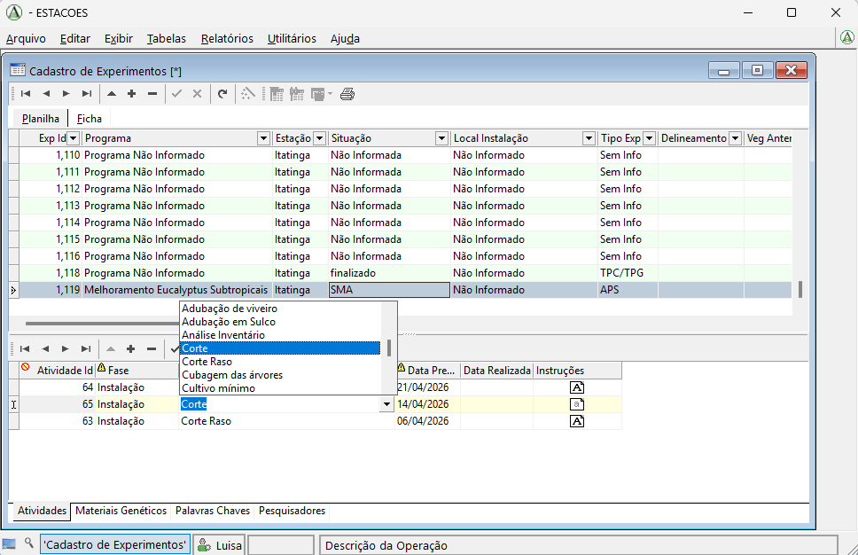
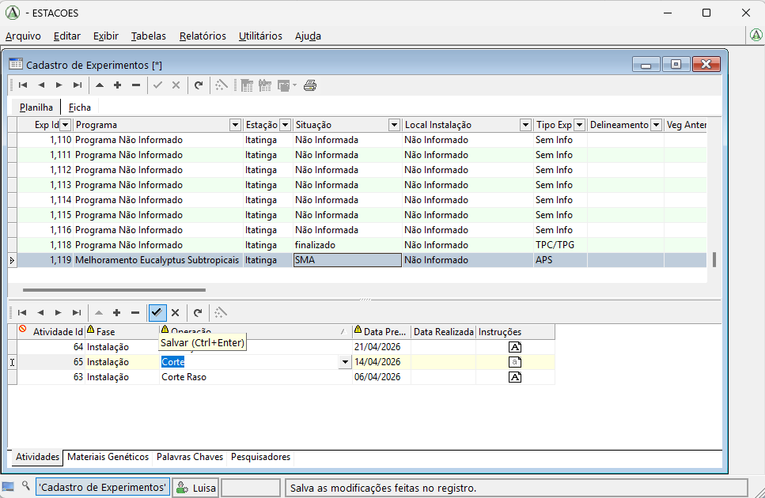

# Alterar ou atualizar os dados de um experimento

Nesta página mostramos como alterar informações já cadastradas no sistema.

Esse procedimento é útil sempre que o usuário perceber que existe algum dado faltando, algum dado incorreto, ou quando for necessário atualizar informações como datas, status ou outros campos do experimento. Por isso, a atualização de dados tende a ser um procedimento frequente no uso do sistema.

## Passo a passo

### 1. Alterar dados na tabela principal

Abra a tabela em que está o dado que deseja alterar.

Em seguida, clique diretamente no campo que deseja corrigir ou complementar, faça a alteração e, ao final, clique no botão de **check**, localizado acima da tabela, para salvar.

Enquanto a alteração não for salva, toda a linha que está sendo editada ficará destacada em **amarelo**. Depois de salvar, a linha volta a ficar em **verde**.

Também é importante lembrar que só é possível alterar outra linha, ou editar dados em outra tabela, depois que a alteração atual já tiver sido salva.

### 2. Alterar dados nas tabelas inferiores

Nas tabelas inferiores, o procedimento é exatamente o mesmo.

Primeiro, clique no campo que deseja alterar e faça a edição normalmente.

Enquanto a linha estiver em edição, ela permanecerá destacada em **amarelo**. Para concluir a alteração, clique no botão de **check** acima da tabela.

Depois de salvar, a linha volta a ficar em **verde**.

## Vídeo

<video controls width="100%">
  <source src="../videos/atualizarDados.mp4" type="video/mp4">
  Seu navegador não suporta a exibição deste vídeo.
</video>
