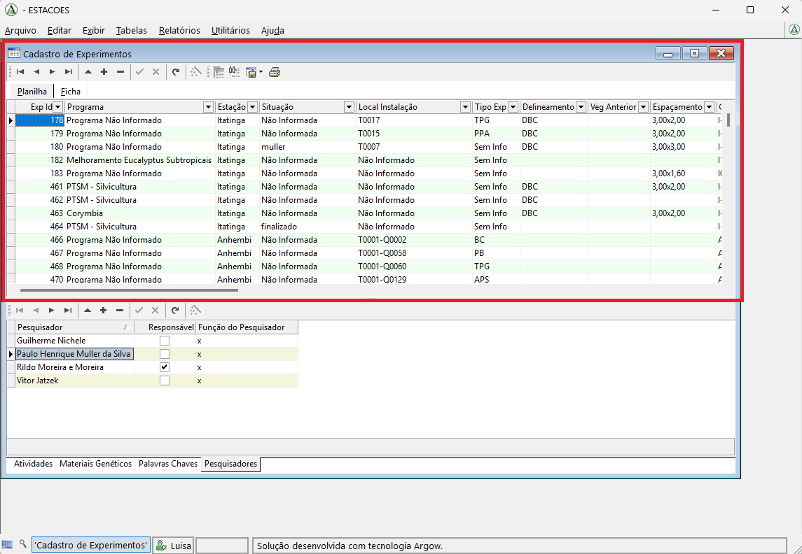
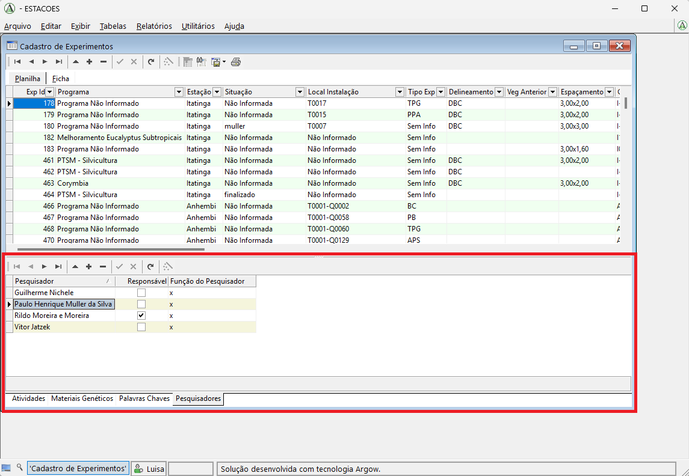
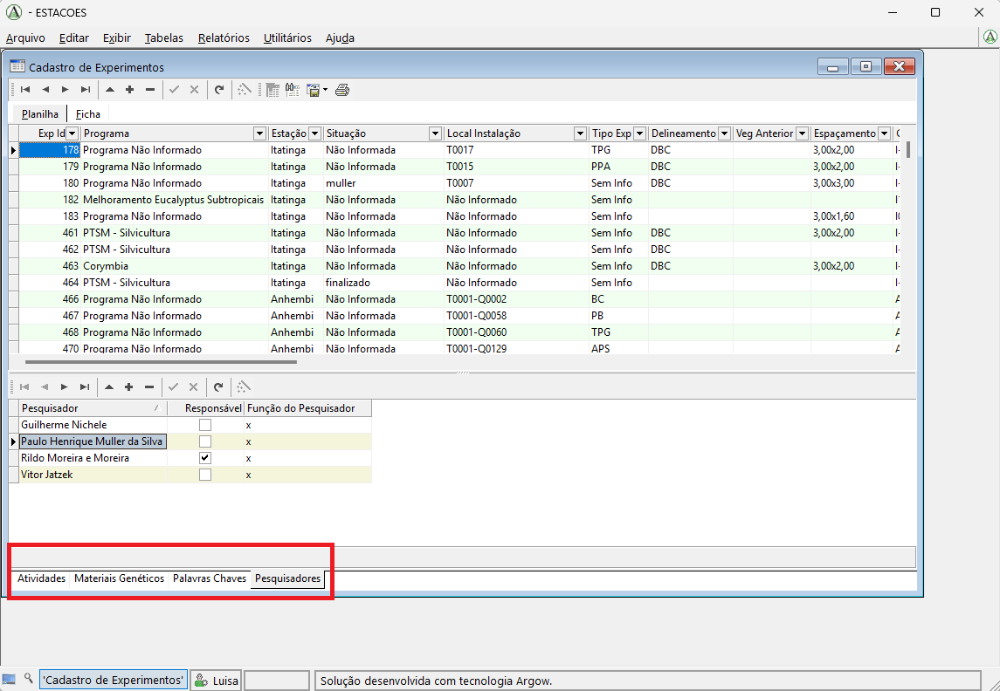
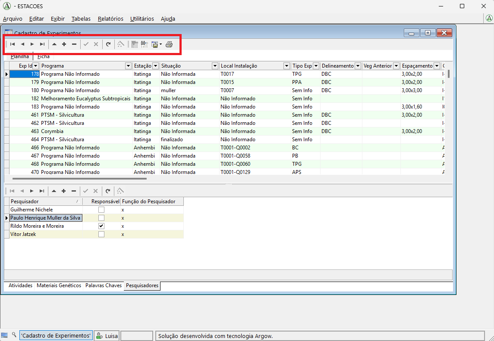
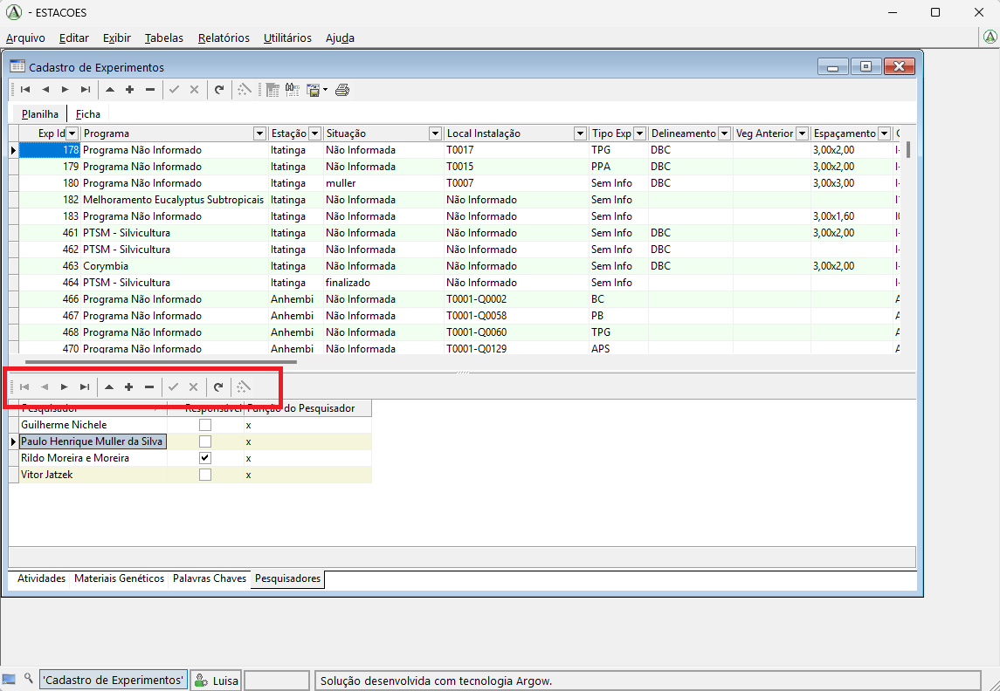
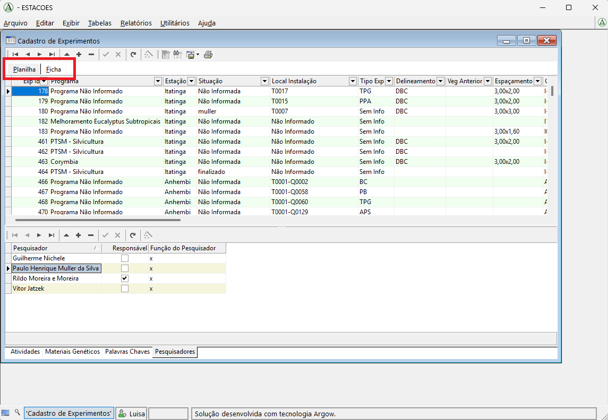
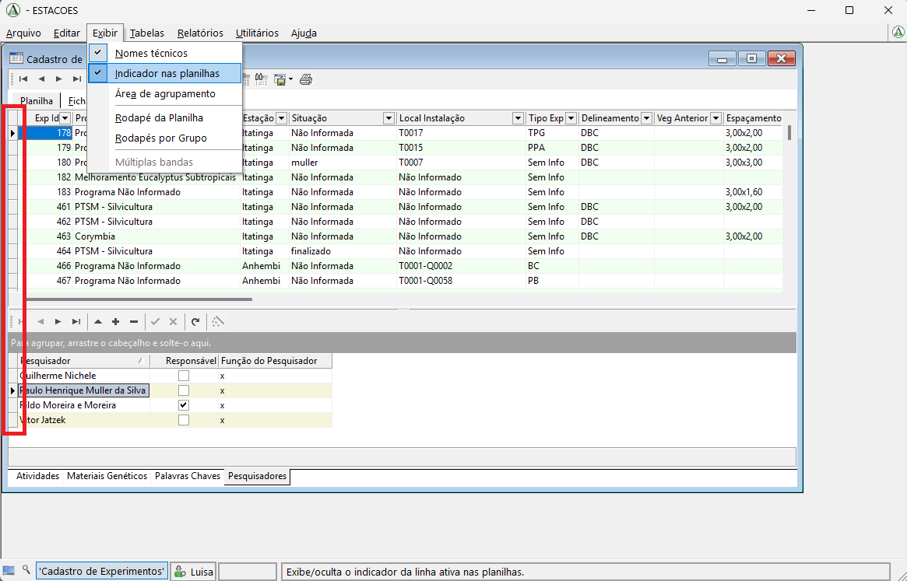
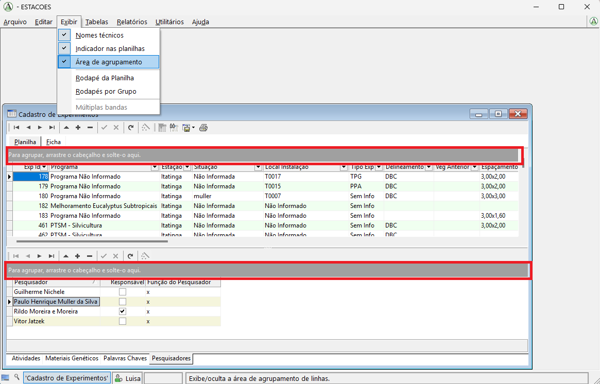
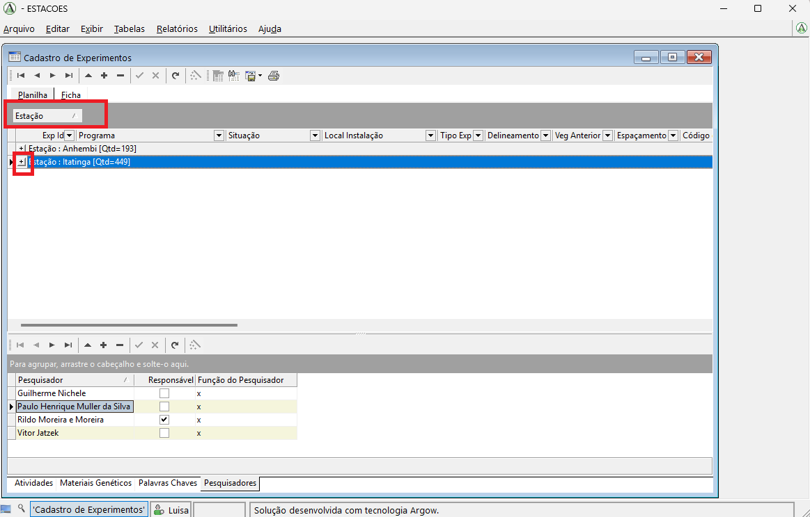
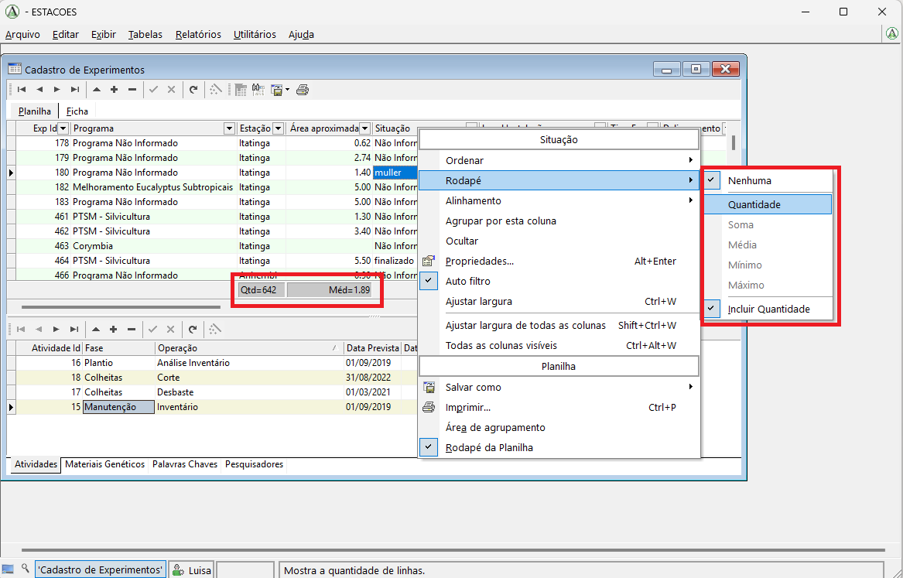

# Primeiros Passos

Esta página apresenta uma visão introdutória do Argow no contexto do SGPF e tem como objetivo orientar o usuário sobre a organização geral da interface e sobre os principais elementos utilizados na navegação e no manejo das tabelas do sistema.

Uma característica importante do Argow é a padronização da interface entre as diferentes tabelas do sistema. De modo geral, as telas apresentam a mesma estrutura, os mesmos comandos e a mesma lógica de operação.

Essa padronização é uma das principais vantagens do software, pois significa que, ao aprender a utilizar uma tabela, o usuário passa a compreender também o funcionamento básico das demais.

## Objetivo do sistema

O principal objetivo do software é permitir a visualização, a inclusão e a atualização de dados armazenados no banco de dados do SGPF.

Na prática, o uso do sistema é baseado principalmente na abertura de tabelas, na consulta das informações registradas e na possibilidade de alterar ou complementar os dados já existentes.

## Abertura das tabelas

Para abrir uma tabela, basta acessar o menu **Tabelas** e selecionar a opção desejada.

Nos exemplos desta página, utilizamos a tabela **Cadastro de Experimentos**, que reúne os experimentos cadastrados no sistema.

## Organização da tela

### 1. Tabela principal

Quando uma tabela é aberta, a parte superior da janela apresenta a tabela principal selecionada.

No exemplo abaixo, a área destacada em vermelho corresponde à tabela **Cadastro de Experimentos**.

### 2. Tabelas relacionadas

Quando a tabela principal possui tabelas relacionadas, essas tabelas são exibidas na parte inferior da janela.

Essas tabelas inferiores apresentam informações complementares associadas ao registro selecionado na tabela superior.

Por exemplo, um experimento pode ter mais de um pesquisador associado. Nesse caso, ao selecionar um experimento na tabela principal, a lista de pesquisadores vinculados a ele pode ser visualizada em uma tabela inferior.

### 3. Alternância entre tabelas inferiores

Em algumas telas, pode haver mais de uma tabela relacionada na parte inferior.

Nesse caso, o usuário pode alternar entre elas por meio das opções disponíveis na área inferior da janela.

Na tela de **Cadastro de Experimentos**, por exemplo, estão disponíveis as tabelas:

- **Atividades**
- **Materiais Genéticos**
- **Palavras-chave**
- **Pesquisadores**

## Barra de comandos da tabela principal

Acima da tabela principal existe uma barra de comandos com funções de navegação, edição, inserção, exclusão, salvamento e consulta.

Na ordem em que aparecem na interface, os botões são:

- **Primeiro**: vai para a primeira linha da tabela.
- **Anterior**: vai para a linha anterior.
- **Seguinte**: vai para a linha seguinte.
- **Último**: vai para a última linha da tabela.
- **Editar**: inicia a edição da linha selecionada.
- **Inserir**: adiciona uma nova linha à tabela.
- **Excluir**: remove a linha selecionada.
- **Salvar**: salva as alterações realizadas.
- **Cancelar**: cancela as alterações realizadas.
- **Atualizar**: recarrega os dados exibidos.
- **Wizard**.
- **Filtro**.
- **Localizar avançado**.
- **Salvar como**: exporta os dados.
- **Imprimir**.

## Barra de comandos das tabelas inferiores

As tabelas inferiores também possuem uma barra de comandos própria, com funções muito semelhantes às da tabela principal.

Na ordem em que aparecem na interface, os botões são:

- **Primeiro**: vai para a primeira linha da tabela.
- **Anterior**: vai para a linha anterior.
- **Seguinte**: vai para a linha seguinte.
- **Último**: vai para a última linha da tabela.
- **Editar**: inicia a edição da linha selecionada.
- **Inserir**: adiciona uma nova linha à tabela.
- **Excluir**: remove a linha selecionada.
- **Salvar**: salva as alterações realizadas.
- **Cancelar**: cancela as alterações realizadas.
- **Atualizar**.
- **Wizard**.

## Modos de visualização da tabela principal

Na tabela superior, o usuário pode optar por diferentes formas de visualização das informações.

Uma possibilidade é visualizar os dados em formato de planilha, com as informações distribuídas em colunas, de maneira semelhante ao Excel.

Outra possibilidade é selecionar a opção **Ficha**, em que o sistema passa a mostrar apenas as informações do registro atualmente selecionado.

## Indicador nas planilhas

Uma funcionalidade simples, mas bastante útil na navegação das tabelas, é o recurso **Indicador nas planilhas**.

Para ativá-lo, acesse o menu principal **Exibir** e clique em **Indicador nas planilhas**.

Quando essa opção está habilitada, uma barra lateral passa a ser exibida no lado esquerdo da tabela. Essa barra permite selecionar a linha inteira, e não apenas uma célula isolada.

Antes da ativação desse recurso, a seleção normalmente fica restrita à célula clicada. Depois de habilitá-lo, a seleção de linhas passa a ser feita diretamente pela barra lateral, o que também permite selecionar mais de uma linha quando necessário.

## Área de agrupamento

Outra funcionalidade útil para a visualização dos dados é a **Área de agrupamento**, que permite organizar a tabela de acordo com os valores de uma coluna específica.

Para exibir esse recurso, acesse o menu principal **Exibir** e selecione **Área de agrupamento**.

Ao habilitar essa opção, uma faixa cinza passa a ser exibida acima da tabela.

Para agrupar os registros, basta clicar no título da coluna desejada e arrastá-lo até essa área.

No exemplo abaixo, a tabela foi agrupada pela coluna **Estações**.

Depois de realizar o agrupamento, é possível visualizar os registros de cada grupo clicando no botão de **mais** exibido ao lado do nome correspondente.

## Rodapé da planilha

Outra funcionalidade útil para análise rápida dos dados é o recurso **Rodapé da planilha**.

Para ativá-lo, acesse o menu **Exibir** e selecione **Rodapé da planilha**.

Ao habilitar essa opção, um rodapé passa a ser exibido na tabela, permitindo mostrar informações resumidas para colunas específicas.

Para adicionar uma métrica, clique com o botão direito no nome da coluna desejada, selecione a opção **Rodapé** e escolha a informação que deseja exibir.

Entre as métricas disponíveis, podem estar, por exemplo, **quantidade**, **média**, **mínimo** e **máximo**.

Depois da seleção, o valor calculado passa a ser exibido no rodapé, abaixo da coluna correspondente.

## Observação

Esta página apresenta apenas uma introdução ao funcionamento geral da interface. Nos próximos tópicos da documentação, serão detalhados os procedimentos de cadastro, atualização, complementação de listas e exportação de dados.
