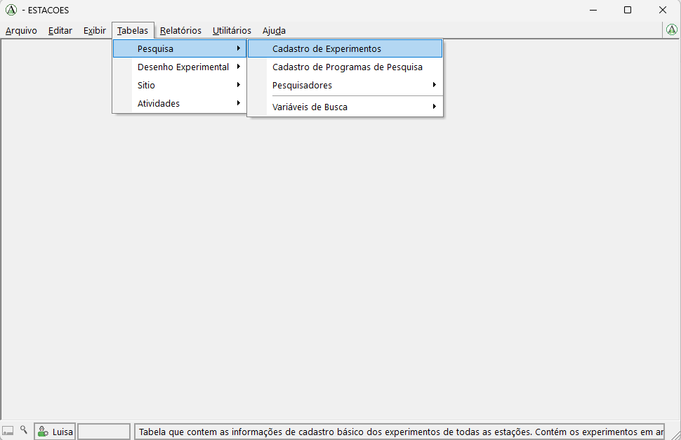
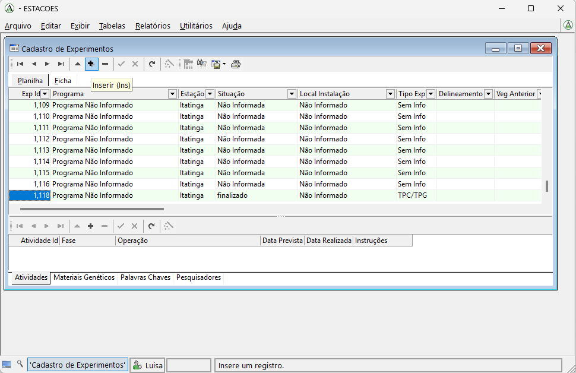
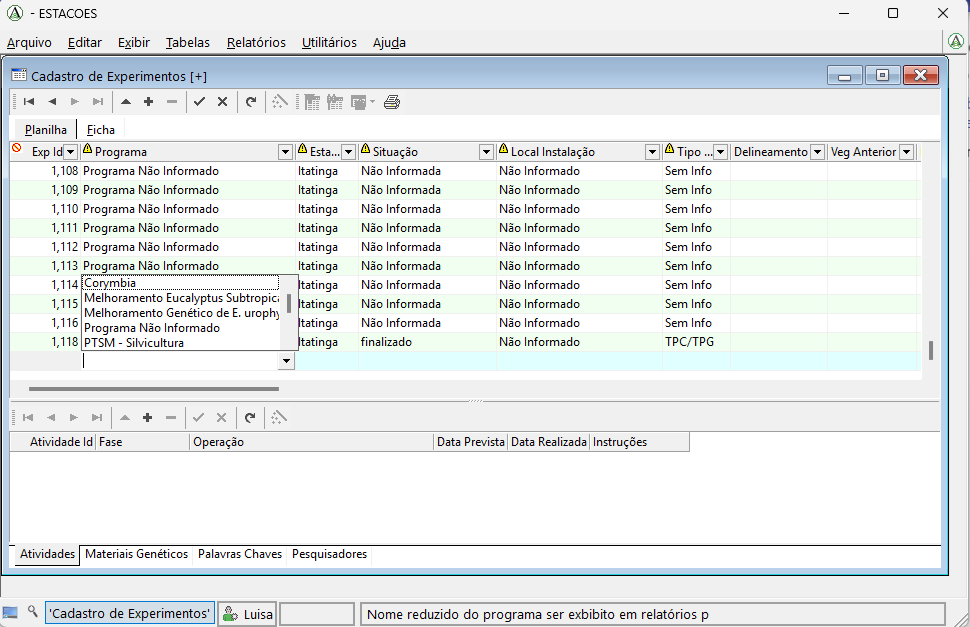
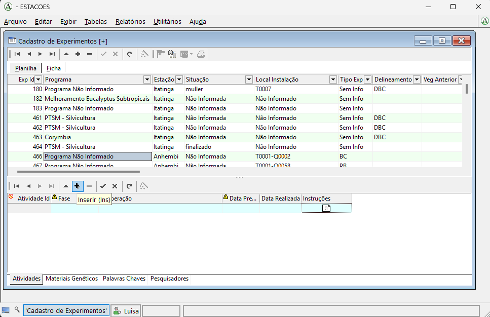
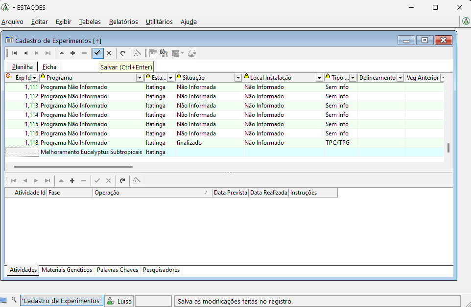
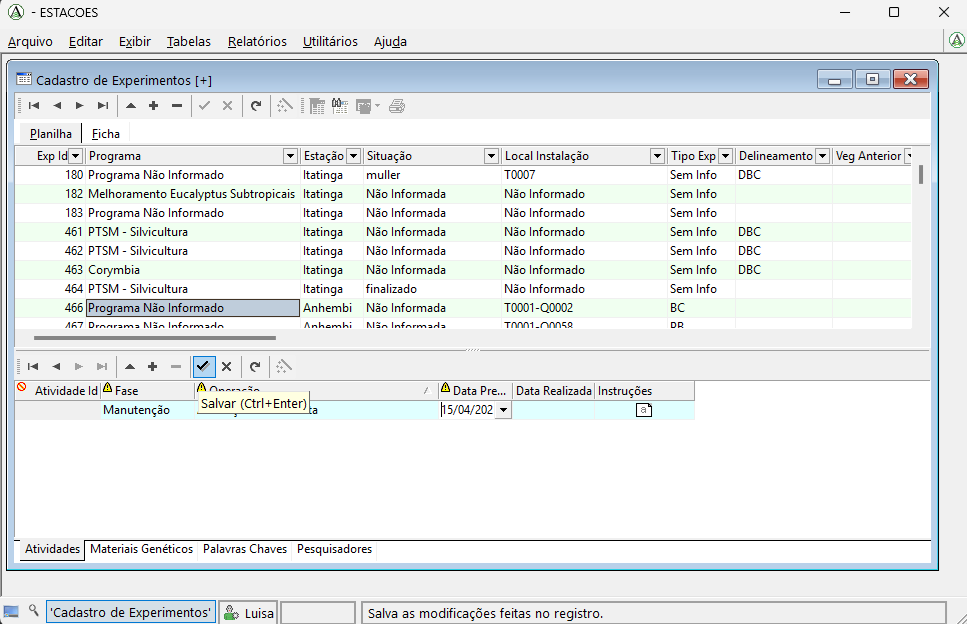
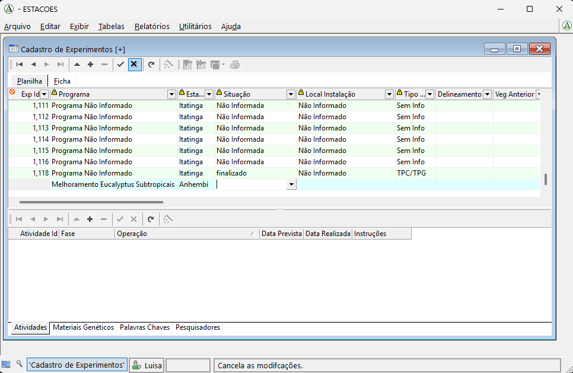
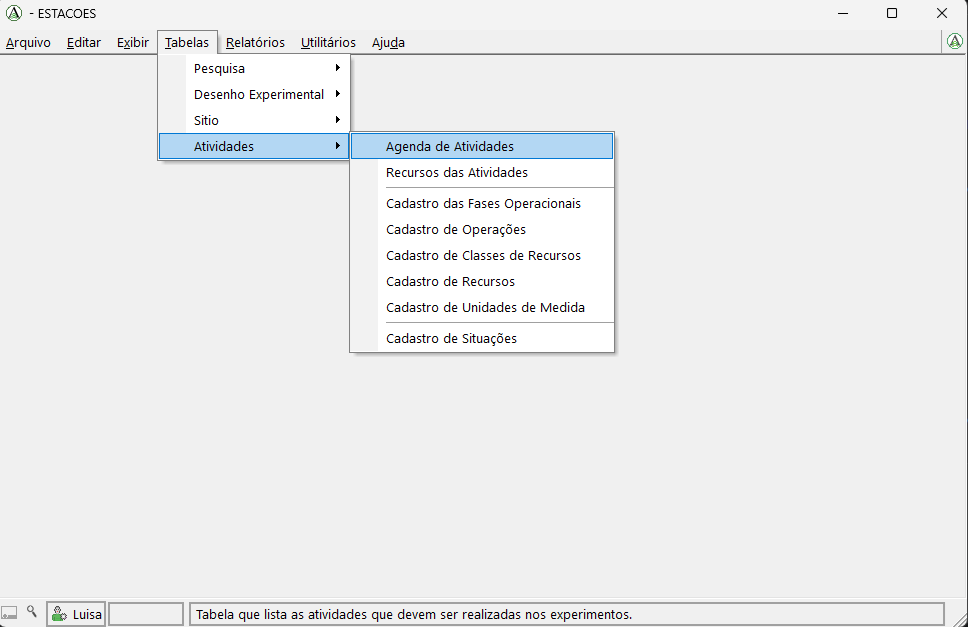
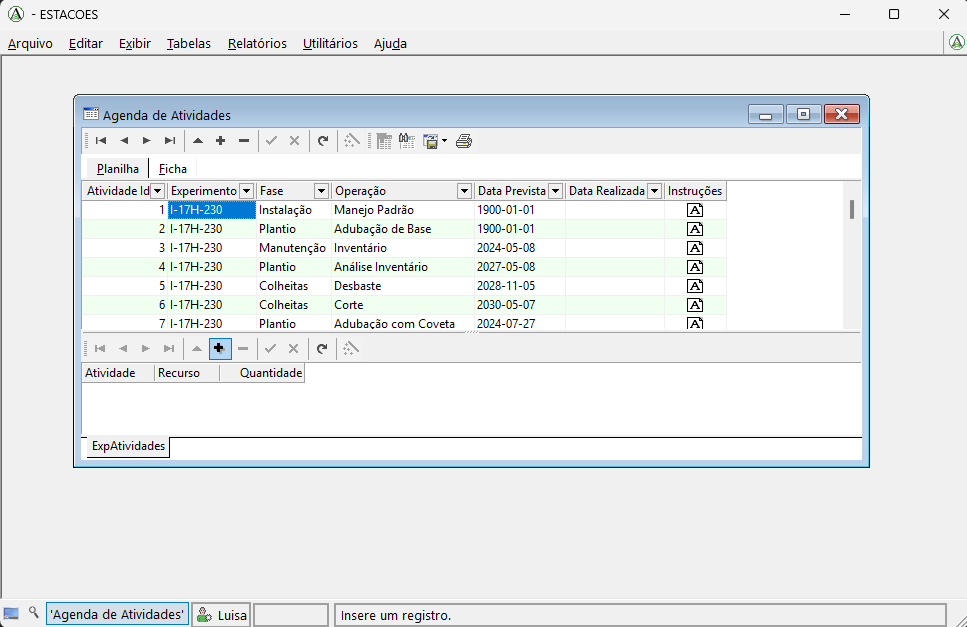

# Cadastro de Experimento

Nesta página apresentamos o passo a passo para cadastrar um novo experimento no banco de dados de experimentos da USP usando o Argow.

## Passo a passo

### 1. Abrir a tela de cadastro de experimentos

No menu superior do Argow, clique em **Tabelas**, depois em **Pesquisa** e, em seguida, em **Cadastro de Experimentos**.

Esse caminho abre a tabela em que o novo experimento será cadastrado.

### 2. Criar um novo cadastro

Ao clicar em **Cadastro de Experimentos**, será aberta a tabela em que todos os experimentos já cadastrados estão listados.

Para adicionar um novo experimento, clique no botão com o símbolo de **+**, localizado na parte superior esquerda da tabela.

### 3. Preencher os dados do experimento

Ao clicar no botão **+**, uma nova linha em branco será criada na tabela para o preenchimento do novo experimento.

A coluna **Exp Id** não deve ser preenchida, pois esse identificador será gerado automaticamente pelo sistema.

As demais colunas devem ser preenchidas de acordo com as informações do experimento:

- Quando o campo for categórico, será exibida uma lista para seleção.
- Quando o campo for numérico, o valor deve ser digitado diretamente.
- Quando o campo for de imagem, como na coluna **Croqui**, clique na setinha da célula, escolha a opção **Opções** e selecione a imagem que será carregada.

Na coluna **Programa**, por exemplo, o preenchimento é feito por meio de uma lista de opções.

#### Dica

Se a opção desejada não aparecer na lista de um campo categórico, é possível adicionar novas opções.

Esse procedimento será mostrado no tutorial **Complementar características**.

### 4. Preencher as tabelas complementares do experimento

Depois de adicionar as informações do experimento na tabela principal, é necessário preencher também as quatro tabelas que aparecem abaixo.

Essas tabelas guardam informações associadas ao experimento, mas que podem ter mais de um registro para o mesmo experimento:

- **Atividades**
- **Materiais genéticos**
- **Palavras-chave**
- **Pesquisadores**

Por exemplo, um mesmo experimento pode ter mais de uma atividade. Nesse caso, deve ser adicionada uma linha na tabela **Atividades** para cada atividade cadastrada.

Para inserir uma nova linha, primeiro selecione a aba da tabela desejada. Em seguida, clique no botão com o símbolo de **+**, localizado acima da tabela.

### 5. Salvar as informações inseridas

Depois de preencher os dados em cada tabela, é necessário salvar as informações.

Para isso, clique no botão com o símbolo de **check**, localizado acima da tabela correspondente.

Na tabela principal de cadastro do experimento, o botão de salvamento aparece na parte superior da tabela:

Nas tabelas complementares, como **Atividades**, **Materiais genéticos**, **Palavras-chave** e **Pesquisadores**, o salvamento também é feito pelo botão de **check** acima da tabela selecionada:

Se for necessário cancelar o que foi preenchido ou excluir a inserção feita, clique no botão **X**.

### 6. Abrir a Agenda de Atividades

Depois de cadastrar o experimento e suas informações básicas, o próximo passo é adicionar os recursos necessários para cada atividade.

Para isso, no menu principal, clique em **Tabelas**, depois em **Atividades** e, em seguida, em **Agenda de Atividades**.

Esse caminho abre a tabela que mostra as atividades de todos os experimentos cadastrados.

### 7. Adicionar os recursos de cada atividade

Na tabela **Agenda de Atividades** são exibidas as atividades de todos os experimentos cadastrados.

Para adicionar os recursos, primeiro clique na linha que corresponde ao experimento e à atividade desejados. Em seguida, na tabela inferior, adicione os recursos relacionados a essa atividade.

Lembre-se de que uma mesma atividade pode ter mais de um recurso. Portanto, se necessário, adicione uma linha para cada recurso.

Para inserir um novo recurso, clique no botão com o símbolo de **+**. Ao finalizar o preenchimento, clique no botão de **check** para salvar.

#### Dica

Se o recurso que você deseja adicionar não estiver listado, é possível incluí-lo na lista de recursos.

Esse procedimento será mostrado em um tutorial específico.

## Vídeo do procedimento

<video controls width="100%">
  <source src="../videos/cadastroExperimento.mp4" type="video/mp4">
  Seu navegador não suporta a exibição deste vídeo.
</video>
