# Complementar características

Nesta página reunimos mini tutoriais para os casos em que uma opção necessária não aparece na lista de uma variável categórica do sistema.

Isso pode acontecer, por exemplo, durante o [cadastro de experimento](cadastroExperimento.md), quando o usuário precisa selecionar um valor em um campo como **Programa**, mas a opção desejada ainda não está cadastrada.

Nesses casos, é necessário adicionar a nova opção na lista correspondente antes de concluir o preenchimento do experimento.

Cada seção abaixo apresenta um tutorial curto e específico para mostrar como incluir novos itens em uma lista do sistema.

## Variáveis cobertas nesta página

- [Programa](#programa)
- [Delineamento](#delineamento)
- [Unidade amostral](#unidade-amostral)
- [Elemento de medição](#elemento-de-medicao)
- [Tipo de experimento](#tipo-de-experimento)
- [Espaçamento](#espacamento)
- [Local de instalação](#local-de-instalacao)
- [Vegetação](#vegetacao)
- [Solo](#solo)
- [Texturas do solo](#texturas-do-solo)
- [Topografia](#topografia)
- [Clima](#clima)
- [Situação](#situacao)

## Como esta página está organizada

Cada mini tutorial segue a mesma estrutura:

- objetivo do tutorial;
- passo a passo com imagens;
- observações importantes, quando necessário;
- vídeo demonstrando o procedimento.

## Programa

Use esta seção quando for necessário adicionar uma nova opção na lista da variável **Programa**.

### Passo a passo

1. No menu superior, clique em **Tabelas**, depois em **Pesquisa** e, em seguida, em **Cadastro de Programas de Pesquisa**.

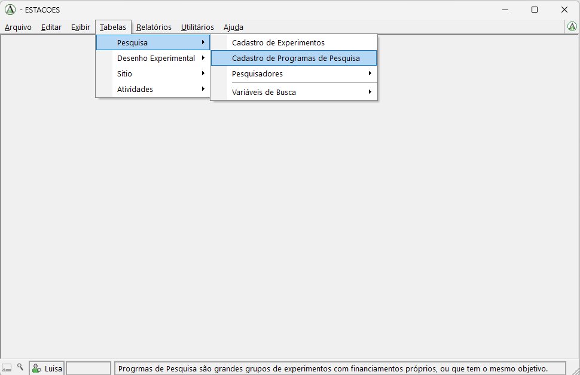

2. Esse caminho abrirá uma tabela com todos os programas cadastrados até o momento.

3. Clique no botão com o símbolo de **+**, localizado acima da tabela, para adicionar um novo programa.

4. Uma nova linha em branco será criada.

5. A coluna **Programa Id** é preenchida automaticamente pelo sistema, portanto não deve ser preenchida pelo usuário.

6. Preencha os campos **Nome do programa** e **Descrição** com as informações do novo programa.

7. Ao final, clique no botão de **check** para salvar.

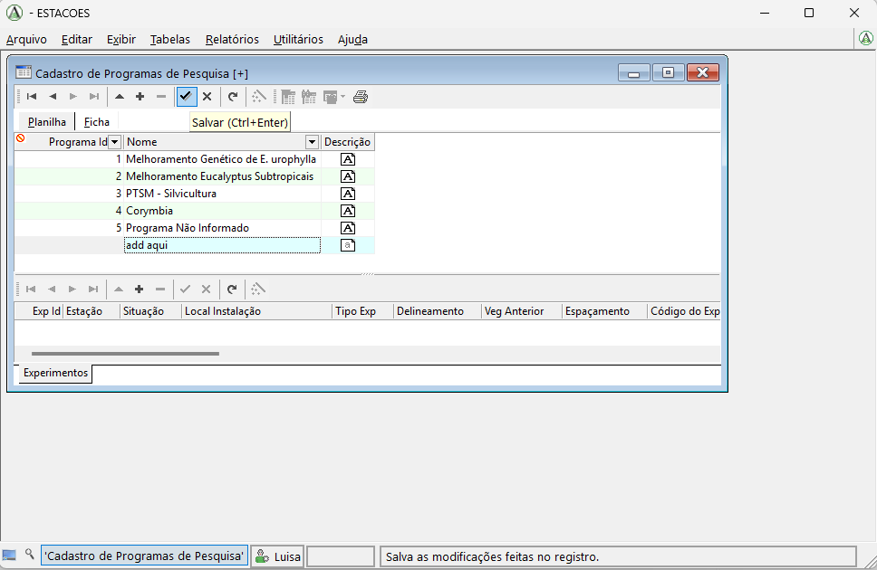

### Vídeo

<video controls width="100%">
  <source src="../videos/programa_v.mp4" type="video/mp4">
  Seu navegador não suporta a exibição deste vídeo.
</video>

## Delineamento

Use esta seção quando for necessário adicionar uma nova opção na lista da variável **Delineamento**.

### Passo a passo

1. No menu superior, clique em **Tabelas**, depois em **Desenho Experimental** e, em seguida, em **Cadastro de tipo de Delineamento**.

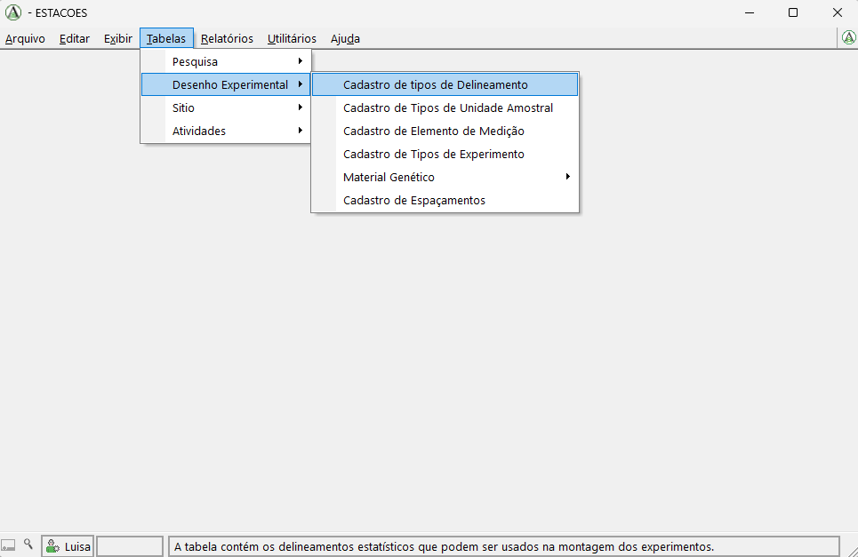

2. Esse caminho abrirá uma tabela com todas as classificações de delineamento cadastradas até o momento.

3. Clique no botão com o símbolo de **+**, localizado acima da tabela, para adicionar um novo delineamento.

4. Uma nova linha em branco será criada.

5. A coluna **Delineamento Id** é preenchida automaticamente pelo sistema, portanto não deve ser preenchida pelo usuário.

6. Preencha os campos **Sigla** e **Descrição** com as informações do novo delineamento.

7. Ao final, clique no botão de **check** para salvar.

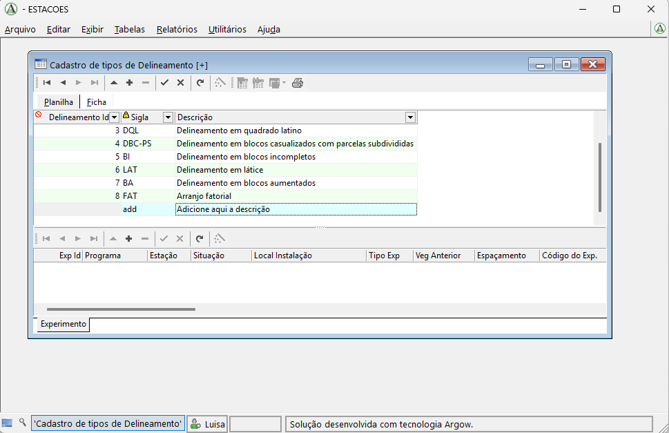

### Vídeo

<video controls width="100%">
  <source src="../videos/Delineamento_v.mp4" type="video/mp4">
  Seu navegador não suporta a exibição deste vídeo.
</video>

## Unidade amostral

Use esta seção quando for necessário adicionar uma nova opção na lista da variável **Unidade amostral**.

### Passo a passo

1. No menu superior, clique em **Tabelas**, depois em **Desenho Experimental** e, em seguida, em **Cadastro de Tipo de Unidade Amostral**.

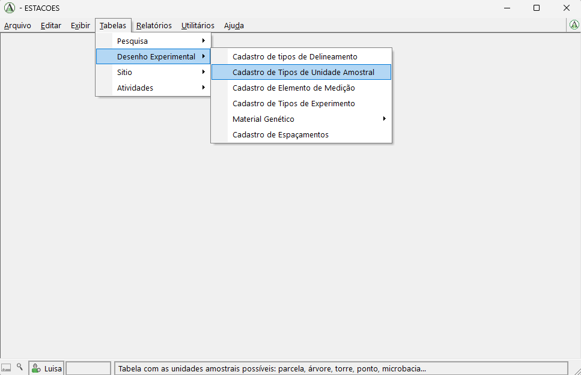

2. Esse caminho abrirá uma tabela com todos os tipos de unidade amostral cadastrados até o momento.

3. Clique no botão com o símbolo de **+**, localizado acima da tabela, para adicionar um novo tipo de unidade amostral.

4. Uma nova linha em branco será criada.

5. A coluna **Unid Amostral Id** é preenchida automaticamente pelo sistema, portanto não deve ser preenchida pelo usuário.

6. Preencha o campo **Descrição** com a informação da nova unidade amostral.

7. Ao final, clique no botão de **check** para salvar.

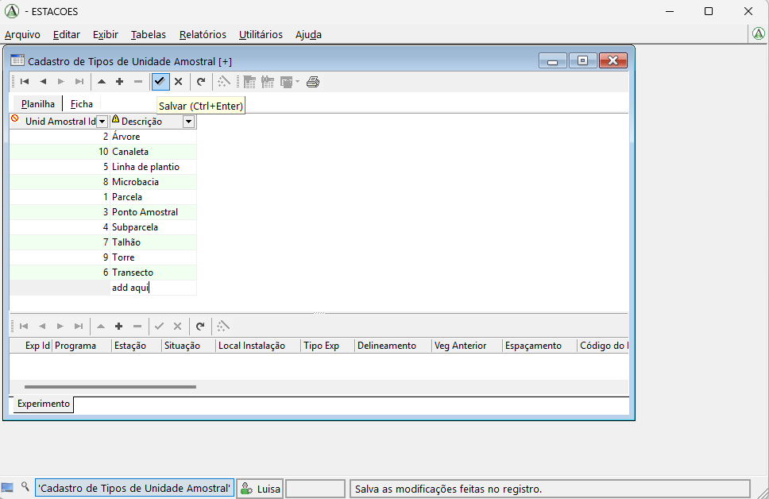

### Vídeo

<video controls width="100%">
  <source src="../videos/UnidAmostral_v.mp4" type="video/mp4">
  Seu navegador não suporta a exibição deste vídeo.
</video>

## Elemento de medição

Use esta seção quando for necessário adicionar uma nova opção na lista da variável **Elemento de medição**.

### Passo a passo

1. No menu superior, clique em **Tabelas**, depois em **Desenho Experimental** e, em seguida, em **Cadastro de Elementos de Medição**.

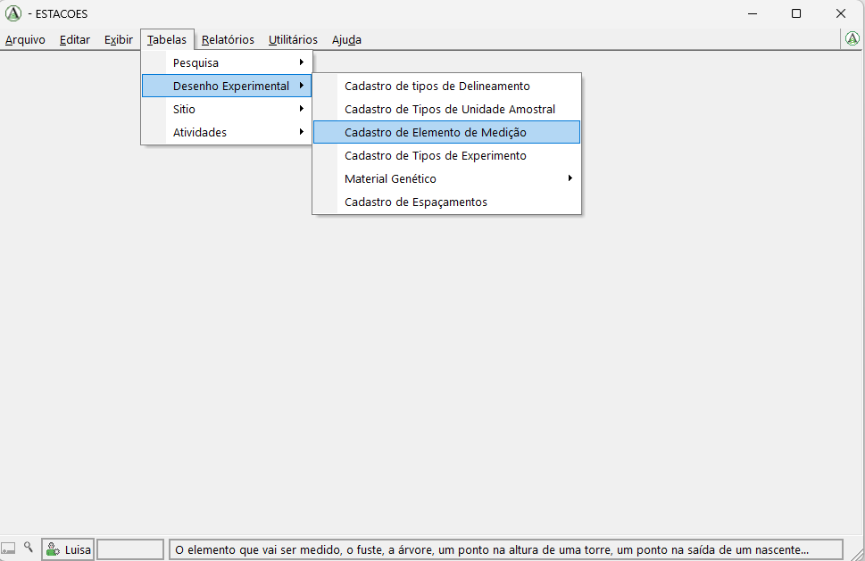

2. Esse caminho abrirá uma tabela com todas as classificações de elementos de medição cadastradas até o momento.

3. Clique no botão com o símbolo de **+**, localizado acima da tabela, para adicionar um novo elemento de medição.

4. Uma nova linha em branco será criada.

5. A coluna **Elementos de Medição Id** é preenchida automaticamente pelo sistema, portanto não deve ser preenchida pelo usuário.

6. Preencha o campo **Descrição** com a informação do novo elemento de medição.

7. Ao final, clique no botão de **check** para salvar.

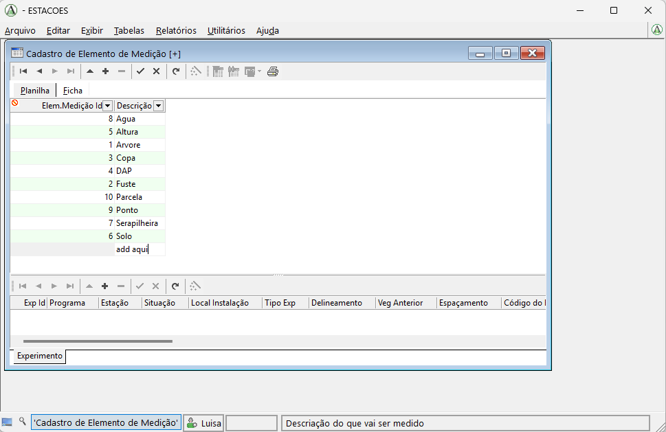

### Vídeo

<video controls width="100%">
  <source src="../videos/elementoMedicao_v.mp4" type="video/mp4">
  Seu navegador não suporta a exibição deste vídeo.
</video>

## Tipo de experimento

Use esta seção quando for necessário adicionar uma nova opção na lista da variável **Tipo de experimento**.

### Passo a passo

1. No menu superior, clique em **Tabelas**, depois em **Desenho Experimental** e, em seguida, em **Cadastro de tipo de Experimento**.

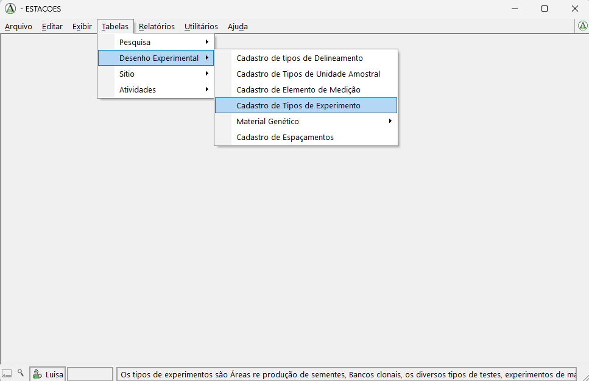

2. Esse caminho abrirá uma tabela com todos os tipos de experimento cadastrados até o momento.

3. Clique no botão com o símbolo de **+**, localizado acima da tabela, para adicionar um novo tipo de experimento.

4. Uma nova linha em branco será criada.

5. A coluna **Tipo Exp Id** é preenchida automaticamente pelo sistema, portanto não deve ser preenchida pelo usuário.

6. Preencha os campos **Sigla** e **Descrição** com as informações do novo tipo de experimento.

7. Ao final, clique no botão de **check** para salvar.

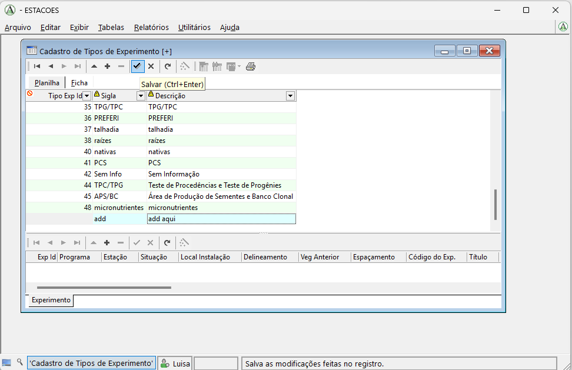

### Vídeo

<video controls width="100%">
  <source src="../videos/tipoExp_v.mp4" type="video/mp4">
  Seu navegador não suporta a exibição deste vídeo.
</video>

## Espaçamento

Use esta seção quando for necessário adicionar uma nova opção na lista da variável **Espaçamento**.

### Passo a passo

1. No menu superior, clique em **Tabelas**, depois em **Desenho Experimental** e, em seguida, em **Cadastro de Elementos de Espaçamentos**.

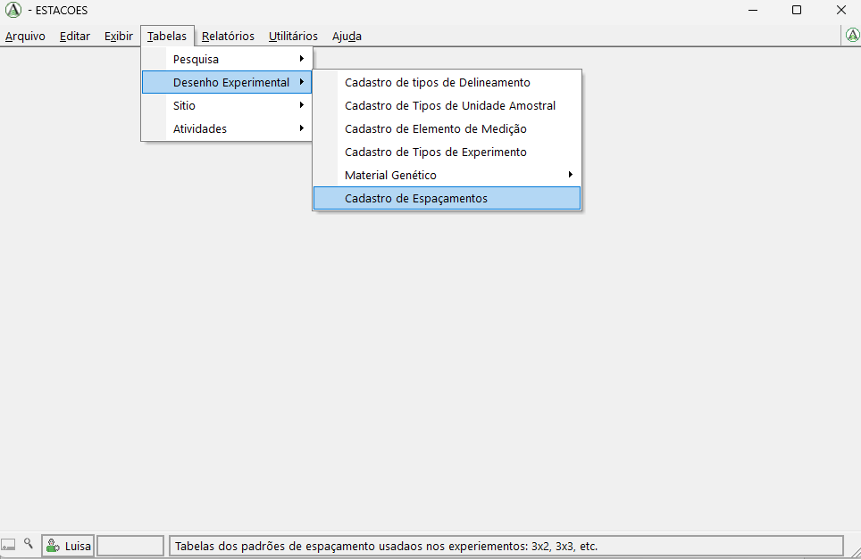

2. Esse caminho abrirá uma tabela com todas as classificações de espaçamento cadastradas até o momento.

3. Clique no botão com o símbolo de **+**, localizado acima da tabela, para adicionar um novo espaçamento.

4. Uma nova linha em branco será criada.

5. A coluna **Espaçamento Id** é preenchida automaticamente pelo sistema, portanto não deve ser preenchida pelo usuário.

6. Preencha os campos **Sigla** e **Descrição** com as informações do novo espaçamento.

7. Ao final, clique no botão de **check** para salvar.

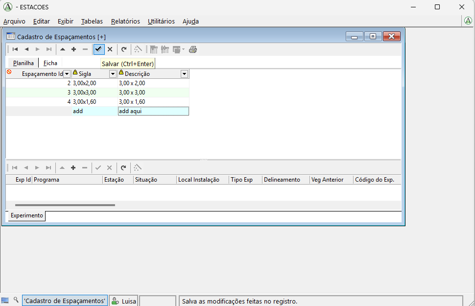

### Vídeo

<video controls width="100%">
  <source src="../videos/espacamento_v.mp4" type="video/mp4">
  Seu navegador não suporta a exibição deste vídeo.
</video>

## Local de instalação

Use esta seção quando for necessário adicionar uma nova opção na lista da variável **Local de instalação**.

### Passo a passo

1. No menu superior, clique em **Tabelas**, depois em **Sítio** e, em seguida, em **Cadastro dos Locais de Instalação**.

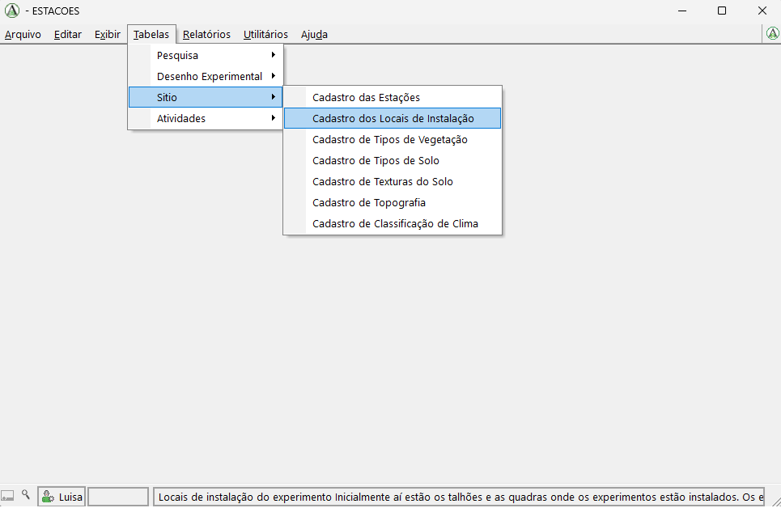

2. Esse caminho abrirá uma tabela com todas as classificações de local de instalação cadastradas até o momento.

3. Clique no botão com o símbolo de **+**, localizado acima da tabela, para adicionar um novo local de instalação.

4. Uma nova linha em branco será criada.

5. As colunas **Local Id** e **Descrição** são preenchidas automaticamente pelo sistema, portanto não devem ser preenchidas pelo usuário.

6. Preencha os campos **Talhão e quadra** ou **Outro local**, de acordo com a informação que deseja cadastrar.

7. Ao final, clique no botão de **check** para salvar.

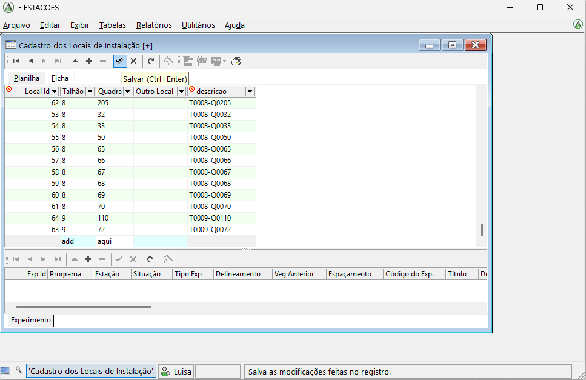

### Vídeo

<video controls width="100%">
  <source src="../videos/localInstalacao_v.mp4" type="video/mp4">
  Seu navegador não suporta a exibição deste vídeo.
</video>

## Vegetação

Use esta seção quando for necessário adicionar uma nova opção na lista da variável **Vegetação**.

### Passo a passo

1. No menu superior, clique em **Tabelas**, depois em **Sítio** e, em seguida, em **Cadastro de Tipos de Vegetação**.

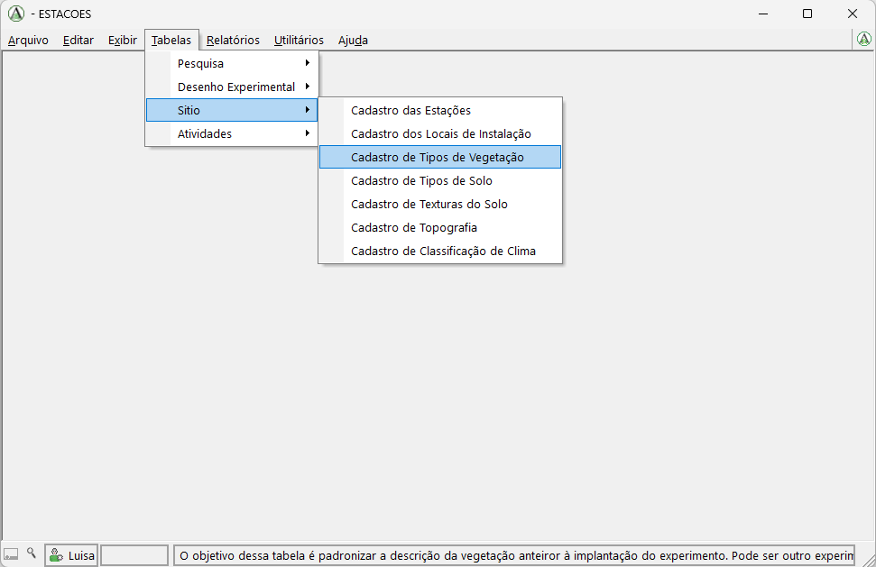

2. Esse caminho abrirá uma tabela com todos os tipos de vegetação cadastrados até o momento.

3. Clique no botão com o símbolo de **+**, localizado acima da tabela, para adicionar um novo tipo de vegetação.

4. Uma nova linha em branco será criada.

5. A coluna **Vegetação Id** é preenchida automaticamente pelo sistema, portanto não deve ser preenchida pelo usuário.

6. Preencha o campo **Descrição** com a informação da nova vegetação.

7. Ao final, clique no botão de **check** para salvar.

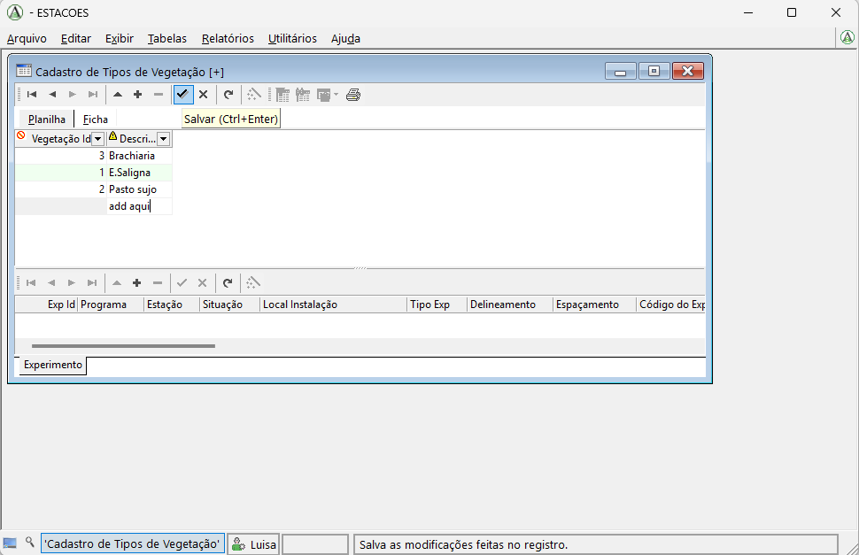

### Vídeo

<video controls width="100%">
  <source src="../videos/vegetacao_v.mp4" type="video/mp4">
  Seu navegador não suporta a exibição deste vídeo.
</video>

## Solo

Use esta seção quando for necessário adicionar uma nova opção na lista da variável **Solo**.

### Passo a passo

1. No menu superior, clique em **Tabelas**, depois em **Sítio** e, em seguida, em **Cadastro de Tipo de Solo**.

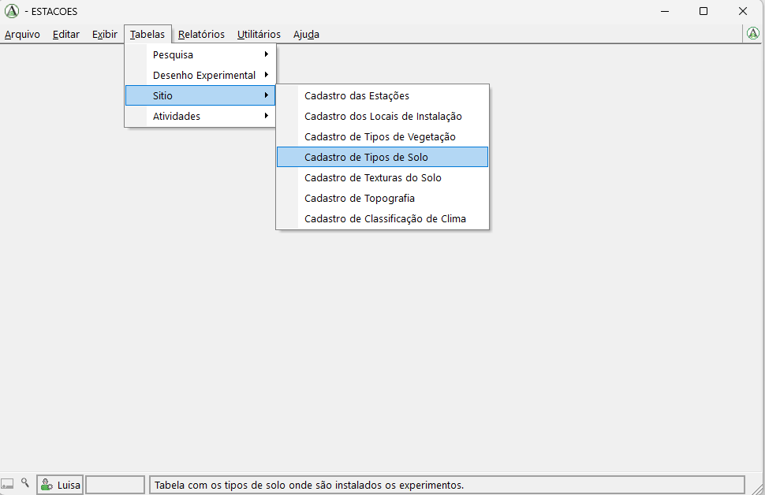

2. Esse caminho abrirá uma tabela com todos os tipos de solo cadastrados até o momento.

3. Clique no botão com o símbolo de **+**, localizado acima da tabela, para adicionar um novo tipo de solo.

4. Uma nova linha em branco será criada.

5. A coluna **Solo Id** é preenchida automaticamente pelo sistema, portanto não deve ser preenchida pelo usuário.

6. Preencha os campos **Sigla** e **Descrição** com as informações do novo tipo de solo.

7. Ao final, clique no botão de **check** para salvar.

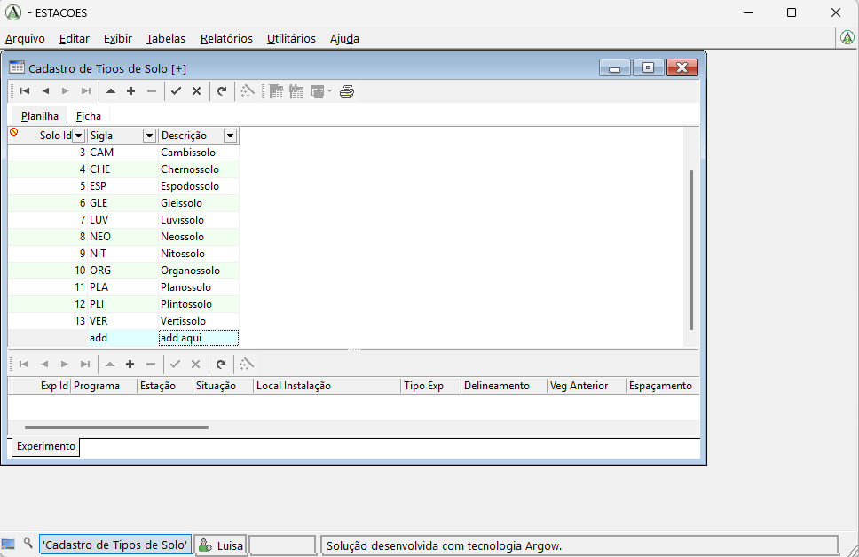

### Vídeo

<video controls width="100%">
  <source src="../videos/solo_v.mp4" type="video/mp4">
  Seu navegador não suporta a exibição deste vídeo.
</video>

## Texturas do solo

Use esta seção quando for necessário adicionar uma nova opção na lista da variável **Texturas do solo**.

### Passo a passo

1. No menu superior, clique em **Tabelas**, depois em **Sítio** e, em seguida, em **Cadastro de Texturas do Solo**.

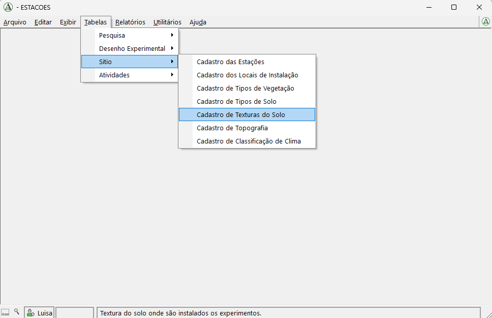

2. Esse caminho abrirá uma tabela com todas as texturas de solo cadastradas até o momento.

3. Clique no botão com o símbolo de **+**, localizado acima da tabela, para adicionar uma nova textura de solo.

4. Uma nova linha em branco será criada.

5. A coluna **Textura Id** é preenchida automaticamente pelo sistema, portanto não deve ser preenchida pelo usuário.

6. Preencha os campos **Sigla** e **Descrição** com as informações da nova textura de solo.

7. Ao final, clique no botão de **check** para salvar.

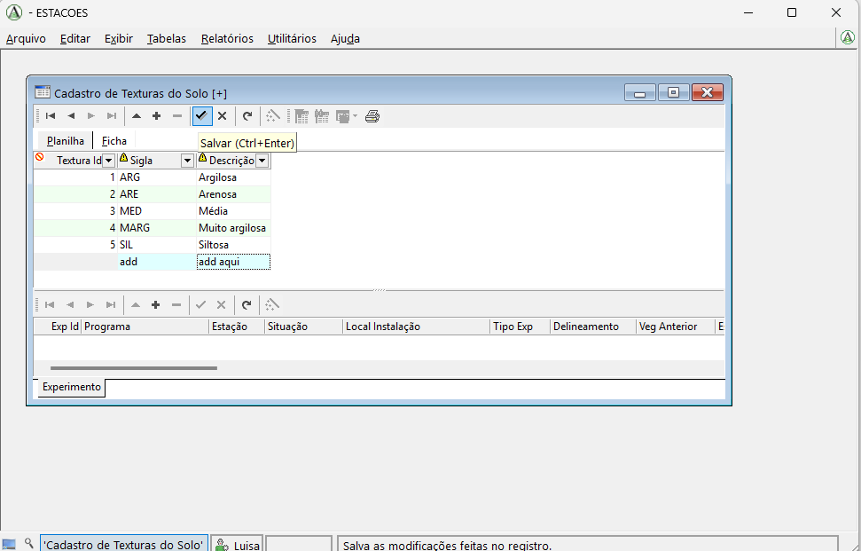

### Vídeo

<video controls width="100%">
  <source src="../videos/texSolo_v.mp4" type="video/mp4">
  Seu navegador não suporta a exibição deste vídeo.
</video>

## Topografia

Use esta seção quando for necessário adicionar uma nova opção na lista da variável **Topografia**.

### Passo a passo

1. No menu superior, clique em **Tabelas**, depois em **Sítio** e, em seguida, em **Cadastro de Topografia**.

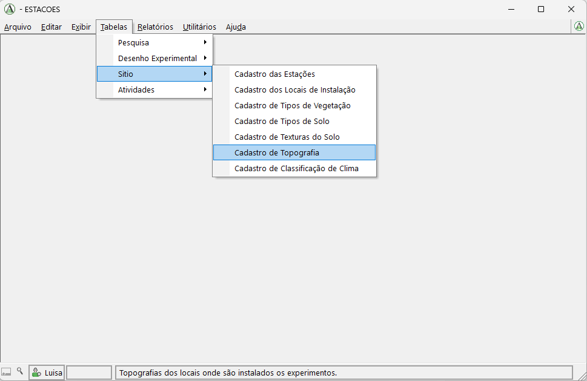

2. Esse caminho abrirá uma tabela com todas as topografias cadastradas até o momento.

3. Clique no botão com o símbolo de **+**, localizado acima da tabela, para adicionar uma nova topografia.

4. Uma nova linha em branco será criada.

5. A coluna **Topografia Id** é preenchida automaticamente pelo sistema, portanto não deve ser preenchida pelo usuário.

6. Preencha os campos **Sigla** e **Descrição** com as informações da nova topografia.

7. Ao final, clique no botão de **check** para salvar.

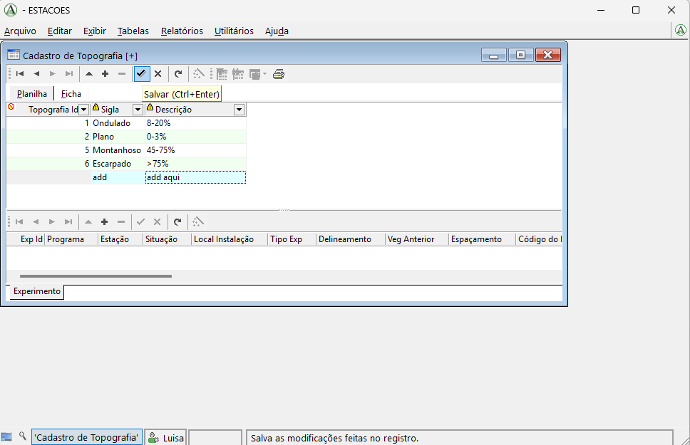

### Vídeo

<video controls width="100%">
  <source src="../videos/topografia_v.mp4" type="video/mp4">
  Seu navegador não suporta a exibição deste vídeo.
</video>

## Clima

Use esta seção quando for necessário adicionar uma nova opção na lista da variável **Clima**.

### Passo a passo

1. No menu superior, clique em **Tabelas**, depois em **Sítio** e, em seguida, em **Cadastro de Classificação de Clima**.

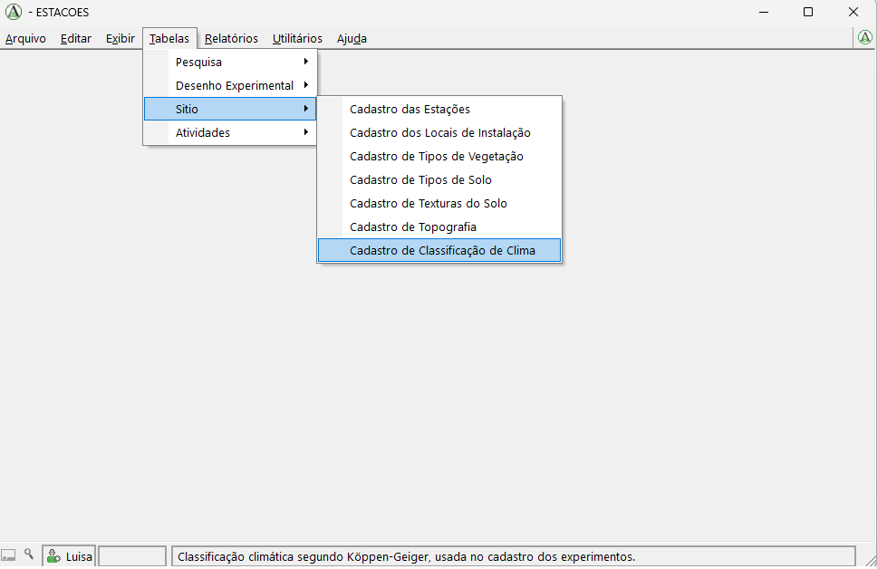

2. Esse caminho abrirá uma tabela com todas as classificações de clima cadastradas até o momento.

3. Clique no botão com o símbolo de **+**, localizado acima da tabela, para adicionar uma nova classificação.

4. Uma nova linha em branco será criada.

5. A coluna **Clima Id** é preenchida automaticamente pelo sistema, portanto não deve ser preenchida pelo usuário.

6. Preencha os campos **Sigla** e **Descrição** com as informações do novo clima.

7. Ao final, clique no botão de **check** para salvar.

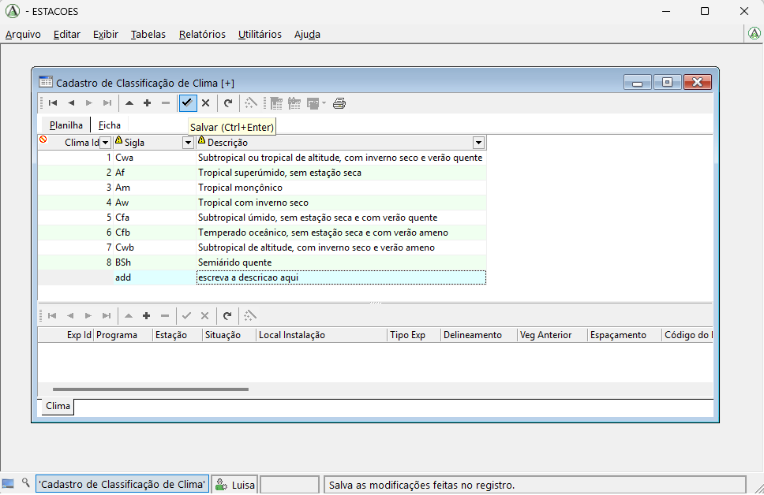

### Vídeo

<video controls width="100%">
  <source src="../videos/clima_v.mp4" type="video/mp4">
  Seu navegador não suporta a exibição deste vídeo.
</video>

## Situação

Use esta seção quando for necessário adicionar uma nova opção na lista da variável **Situação**.

### Passo a passo

1. No menu superior, clique em **Tabelas**, depois em **Atividades** e, em seguida, em **Cadastro de Situações**.

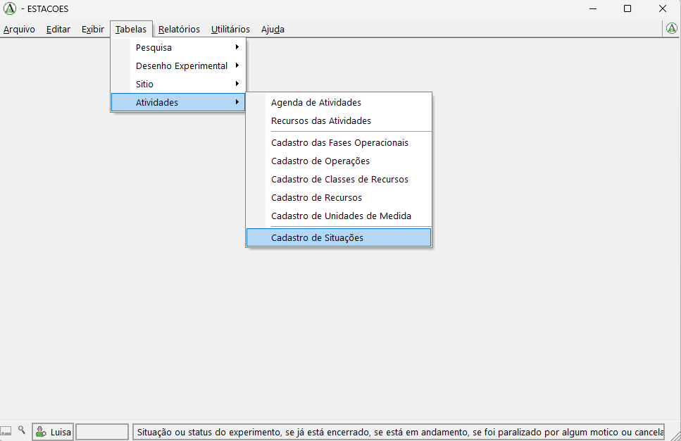

2. Esse caminho abrirá uma tabela com todas as situações cadastradas até o momento.

3. Clique no botão com o símbolo de **+**, localizado acima da tabela, para adicionar uma nova situação.

4. Uma nova linha em branco será criada.

5. A coluna **Situação Id** é preenchida automaticamente pelo sistema, portanto não deve ser preenchida pelo usuário.

6. Preencha o campo **Situação** com a informação que deseja cadastrar.

7. Ao final, clique no botão de **check** para salvar.

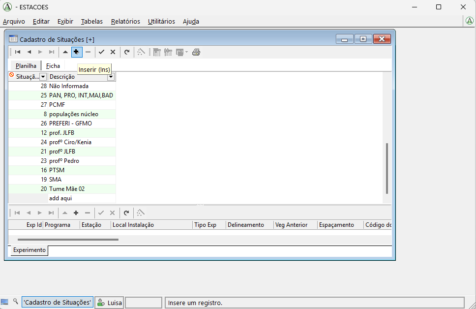

### Vídeo

<video controls width="100%">
  <source src="../videos/situacao_v.mp4" type="video/mp4">
  Seu navegador não suporta a exibição deste vídeo.
</video>
