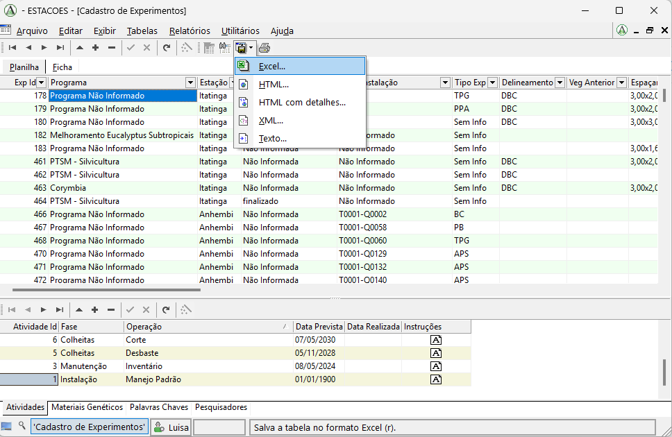
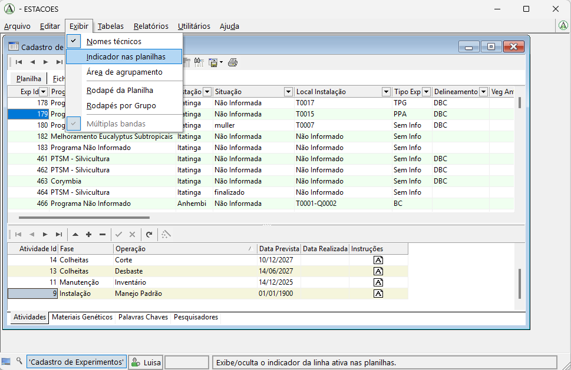
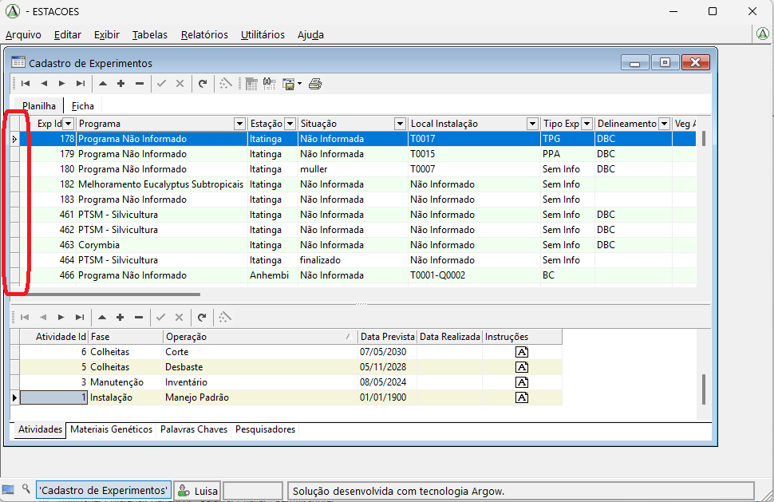
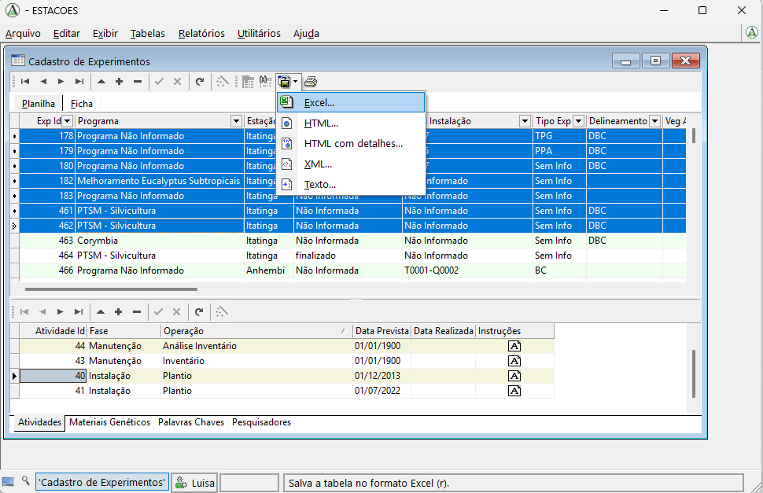

# Exportar resultados

Nesta página mostramos como exportar tabelas do sistema para outros formatos, como Excel, HTML, XML ou texto.

## Passo a passo

### 1. Exportar a tabela principal

Para exportar uma tabela, primeiro abra a tabela desejada no sistema.

No menu superior, logo acima da tabela, clique no botão **Salvar como**. Em seguida, escolha o formato em que deseja exportar os dados:

- Excel
- HTML
- XML
- Texto

Depois disso, será aberta uma janela para que você escolha onde deseja salvar o arquivo exportado.

### 2. Atenção para as tabelas inferiores

Esse procedimento de exportação vale apenas para a tabela principal, ou seja, a tabela que aparece na parte superior da tela.

As tabelas inferiores, que mostram os detalhes do item selecionado acima, não podem ser exportadas diretamente por esse mesmo caminho na tela atual.

Por exemplo, se você quiser exportar dados da tabela **Atividades**, que aparece na parte inferior no exemplo, primeiro deve abrir a tabela **Atividades** como tabela principal. Depois disso, a exportação pode ser feita normalmente pelo botão **Salvar como**.

### 3. Exportar apenas uma linha ou algumas linhas

Se você quiser exportar apenas uma linha, ou apenas algumas linhas da tabela, primeiro precisa selecionar exatamente os registros desejados.

Para isso, verifique se uma barrinha lateral aparece no lado esquerdo da tabela. Essa barrinha é usada para selecionar linhas inteiras.

Se ela não estiver visível, vá ao menu **Exibir** e clique em **Indicador nas planilhas**.

Depois disso, a barrinha lateral passará a aparecer na tabela.

Com essa barrinha visível, você pode selecionar as linhas que deseja exportar:

- clique na barrinha para selecionar a linha;
- use dois cliques para garantir a seleção completa da linha;
- use **Ctrl** para selecionar mais de uma linha separada;
- use **Shift** para selecionar várias linhas contínuas.

Depois de selecionar as linhas desejadas, faça a exportação da mesma forma descrita anteriormente: clique em **Salvar como** e escolha o formato desejado, como **Excel**, **HTML**, **XML** ou **Texto**.

## Vídeo

<video controls width="100%">
  <source src="../videos/exportTable.mp4" type="video/mp4">
  Seu navegador não suporta a exibição deste vídeo.
</video>
